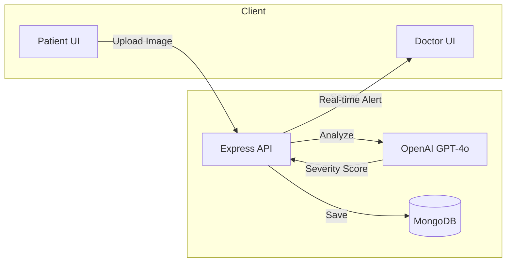

# 🩹 Wound Detector

> AI-powered web application for basic wound identification and first-aid guidance — with real-time doctor monitoring.


---

## 📖 About

**Wound Detector** is a full-stack web application that uses AI to identify common wound types (cuts, burns, scratches, bruises) from uploaded images and provide instant first-aid guidance.

Many people are unsure how to treat minor injuries when medical help isn't immediately available. Our system gives fast, accessible wound assessment, tracks healing progress over time, and includes a **Doctor Mode** for remote monitoring — sending real-time alerts to medical professionals when severe wounds are detected.

Built as the **CPE101 Engineering Exploration final project** at KMUTT.

## ✨ Features

- 📸 **AI Wound Analysis** — upload a wound image, get instant identification and severity scoring (0–10)
- 🩹 **First-Aid Guidance** — clear, easy-to-follow recommendations powered by GPT-4o
- 📈 **Healing Progress Tracking** — daily logs and progress graphs over time
- 👨‍⚕️ **Doctor Mode** — medical professionals get real-time WebSocket alerts for new patient uploads
- 🔐 **Google OAuth Login** — secure authentication via Passport.js
- 🎨 **Animated UI** — smooth interactions with Framer Motion

## 🛠️ Tech Stack

**Frontend**
- React 19 + Vite 7 + TypeScript
- React Router 7
- Recharts (healing progress graphs)
- Framer Motion (animations)
- Socket.IO Client + Axios

**Backend**
- Node.js + Express 5
- MongoDB + Mongoose 8
- OpenAI API (GPT-4o vision)
- Socket.IO Server
- Passport.js (Google OAuth) + JWT
- Multer (file uploads)

## 🏗️ System Architecture



See [`SYSTEM_ARCHITECTURE.md`](./SYSTEM_ARCHITECTURE.md) for the full architecture document.

## 🚀 Getting Started

### Prerequisites
- Node.js 18+
- MongoDB (local or Atlas)
- OpenAI API key

### Backend
```bash
cd backend
npm install
cp env.example .env   # then fill in your keys
npm start
```

### Frontend
```bash
cd frontend
npm install
cp env.example .env
npm run dev
```

## 👥 Team

A 4-person CPE101 project at KMUTT, Faculty of Engineering:

- **Manatsanan Jongjeerangsub** ([@mnsnv](https://github.com/mnsnv))
- **Wasuphon Chaosahnguan** ([@KongWasupol](https://github.com/KongWasupol))
- **Panawut Wongsa**
- **Korn Kongkar**

## 🎯 My Contributions

- 💡 **Concept & ideation** — proposed the wound-detection use case and Doctor Mode feature
- 🎨 **UI/UX design** — designed the interface in Figma, styled the React components, animations
- 📊 **Project poster & presentation** — visual design and storyline

## 🔮 Future Work

- 🌐 **Telehealth integration** — real-time online consultation with doctors
- 🩻 **Expanded wound types** — support more complex wound categories with medically verified datasets
- ☁️ **Cloud storage migration** — move from local file storage to AWS S3 / Supabase

---

🐢 *Built with curiosity at the Faculty of Engineering, KMUTT.*
