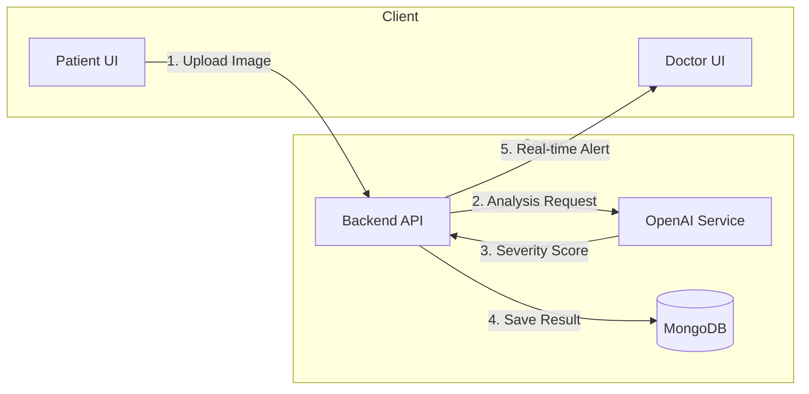

# System Architecture: Wound Detector Platform

## 0. Presentation Data (For Slides)
If you are filling out the "Methodology | System Architecture" slide:

### METHODOLOGY
*   **Dataset**: Real-time Patient Data (User-uploaded wound images). *Note: This system uses pre-trained models (OpenAI GPT-4o) and does not require a custom training dataset.*
*   **Tech**: MERN Stack (MongoDB, Express, React, Node.js) + TypeScript + OpenAI API + Socket.IO.

### SYSTEM ARCHITECTURE
(Use this Mermaid diagram for the visual block)


## 1. Overview
Wound Analyzer is a web-based system that uses AI to identify common wound types from uploaded images and provide instant first-aid guidance. Many people are unsure how to treat minor injuries such as cuts, burns, scratches, or bruises, especially when medical help is not immediately available. Our system offers fast, accessible wound assessment and tracks healing progress over time, helping users make safer decisions before seeking professional care.

Additionally, the system features a dedicated **Doctor Mode** for remote monitoring. This allows medical professionals to track patient healing progress in real-time, receiving instant severity alerts and history logs, ensuring timely intervention while reducing the need for frequent in-person visits.

## 2. Technology Stack

### Frontend
*   **Framework**: React 19 (via Vite 7)
*   **Language**: TypeScript
*   **Routing**: React Router 7
*   **State Management**: React Context API
*   **UI/Styling**: CSS Modules / Vanilla CSS, Framer Motion (animations)
*   **Data Visualization**: Recharts (healing progress graphs)
*   **Communication**: Axios (REST), Socket.IO Client (Real-time)

### Backend
*   **Runtime**: Node.js
*   **Framework**: Express 5
*   **Database**: MongoDB (via Mongoose 8)
*   **Authentication**: Passport.js (Google OAuth 2.0), JWT
*   **File Handling**: Multer (Local storage for images)
*   **AI/ML**: OpenAI API (GPT-4o for image analysis)
*   **Real-time**: Socket.IO Server

## 3. High-Level Architecture

```mermaid
graph TD
    subgraph Client
        P[Patient Client]
        D[Doctor Client]
    end

    subgraph Server
        LB[Load Balancer / Nginx (Implied)]
        API[Express API Server]
        Socket[Socket.IO Server]
        AI[AI Service (OpenAI)]
    end

    subgraph Storage
        DB[(MongoDB)]
        FS[File System (Uploads)]
    end

    P -- HTTP/REST --> API
    D -- HTTP/REST --> API
    P -- WebSocket --> Socket
    D -- WebSocket --> Socket
    
    API -- Read/Write --> DB
    API -- Save Images --> FS
    API -- Analyze Image --> AI
    
    Socket -- Events --> P
    Socket -- Events --> D
```

## 4. Key Workflows

### 4.1. Detailed System Flow
1.  **Patient Action (HTTP Request)**:
    *   The Patient captures or selects an image via the Frontend (React).
    *   The client sends a `POST` request (multipart/form-data) to the backend API endpoint (`/api/analysis/upload`).
    *   The request includes the image file and optional notes.

2.  **Server Processing**:
    *   **Upload**: The Express server receives the request. `Multer` middleware handles the file stream and saves the image to the local `uploads/` directory.
    *   **AI Analysis**: The `AnalysisController` triggers the `AIService`.
    *   The server constructs a prompt containing the image and sends it to the **OpenAI API (GPT-4o)** via an HTTPS request.

3.  **AI Result & Database**:
    *   OpenAI returns the analysis (Severity Score, Wound Type, Healing Recommendations) in JSON format.
    *   The server saves this structured data into the **MongoDB** database (`Analysis` collection).
    *   If this is a new wound, a `Wound` entry is created or updated.

4.  **Doctor Notification (Real-time)**:
    *   Once the analysis is saved, the server's **Socket.IO** instance emits a real-time event (`wound_updated` or `analysis_ready`) to a specific room (`doctors`).
    *   The **Doctor's Frontend**, which is listening to this WebSocket channel, receives the event instantly.
    *   The Doctor's dashboard automatically updates to show the new patient status or critical alert without needing to refresh the page.

### 4.2. Doctor Monitoring Flow
1.  Doctor logs in (role: `doctor`).
2.  Frontend connects to Socket.IO and joins the `doctors` room.
3.  When a patient uploads an image, the doctor receives a real-time alert.
4.  Doctor can view `TrackRequest` or patient history.

## 5. Database Schema

### Users (`User.js`)
*   `_id`: ObjectId
*   `name`, `email`, `password`: Basic auth.
*   `role`: 'patient' | 'doctor'.
*   `googleId`: For OAuth.
*   `allowedDoctors`: Array of Doctor IDs (Access control).
*   `trackedPatients`: Array of Patient IDs.

### Wounds (`Wound.js`)
*   `patient`: Ref to User.
*   `initialSeverity`, `currentSeverity`: Tracking metrics.
*   `status`: 'active' | 'healed' | 'worsening'.
*   `initialImagePath`, `latestImagePath`: Visual history.

### Analyses (`Analysis.js`)
*   `user`: Ref to User.
*   `imagePath`: Path to the analyze image.
*   `severityScore`: AI generated score (0-10).
*   `aiResponse`: Raw text from AI.
*   `model`: Model version used (e.g., 'gpt-4o').

## 6. Directory Structure

### Backend
```
backend/
├── src/
│   ├── config/       # Database & Env config
│   ├── middleware/   # Auth & Upload middleware
│   ├── models/       # Mongoose Schemas
│   ├── routes/       # Express Routes
│   ├── services/     # Business Logic (AI)
│   └── index.js      # Entry point
└── uploads/          # Image storage
```

### Frontend
```
frontend/
├── src/
│   ├── api/          # Axios setup & endpoints
│   ├── components/   # Reusable UI components
│   ├── context/      # AuthContext, etc.
│   ├── hooks/        # Custom hooks
│   ├── pages/        # Route views
│   └── App.tsx       # Root component
```

## 7. Future Considerations
*   **Cloud Storage**: Move local file storage to AWS S3 or Supabase Storage for scalability.
*   **Security**: Ensure `uploads` directory is properly protected/served.
*   **Validation**: Add input validation (Zod/Joi) for API requests.
